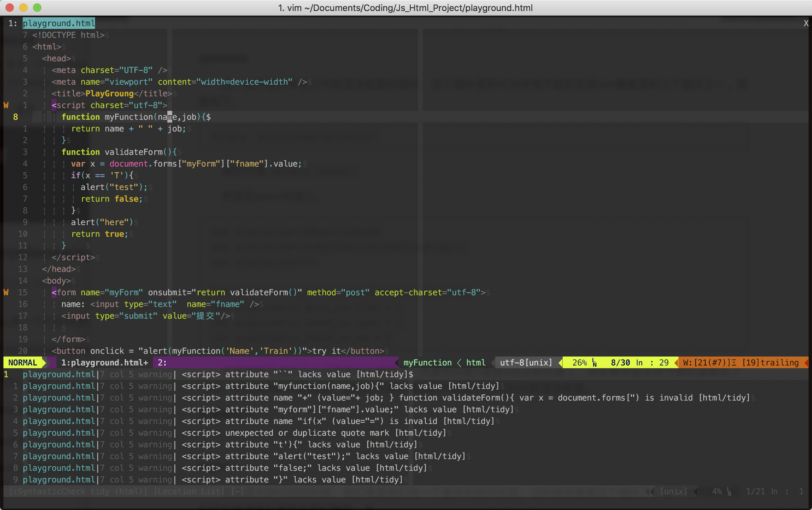

#Welcome to Myvimrc

###Caution

这些是现在我已经安装的Vim插件的配置文件，这份文件也是通过拷贝大神的配置文件然后自己进行修改得到的版本。使用方式如下，下载vimrc后将其中的内容复制到你的`~/.vimrc`中即可。插件中有些插件可能因为你的电脑少安装了部分环境导致不能运行，请根据报错进行排查，或在issue中提交。

Here is my vimrc configure, this vimrc is built base on Other Coder's vimrc. To use this vimrc, you need to replace your vimrc with this one. For in my configure, some plugin may not work in your enviroment, U need to **Read the Plugin's Github** to fix the problem or make a issue report for me.

### 截图

###Final

Thnx for using

