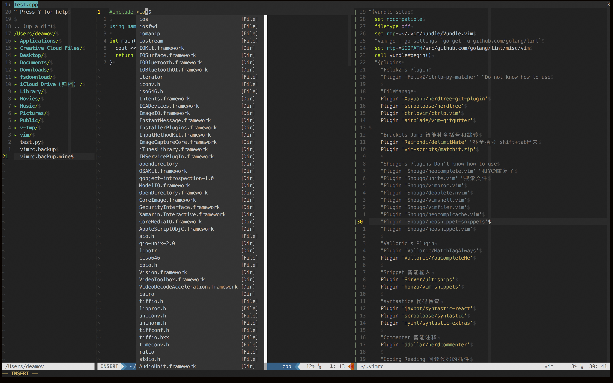
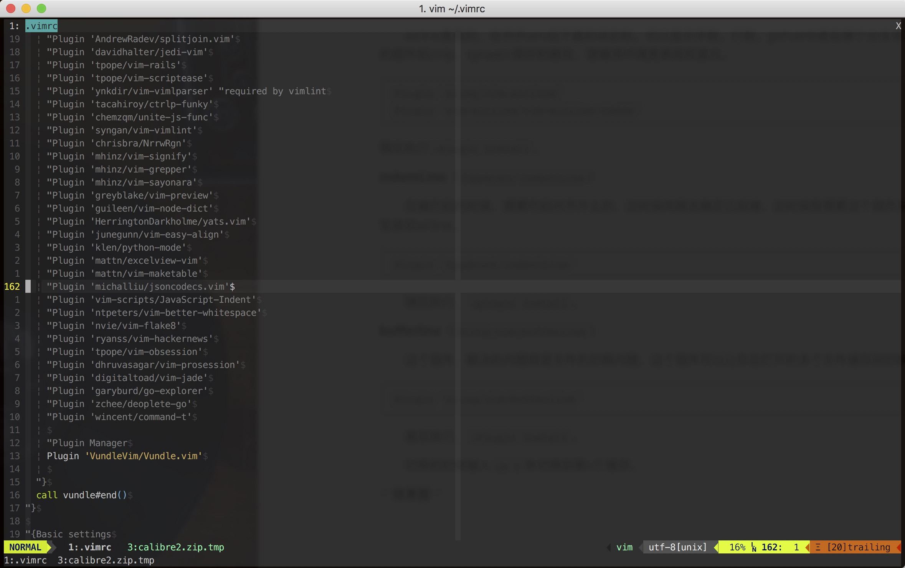
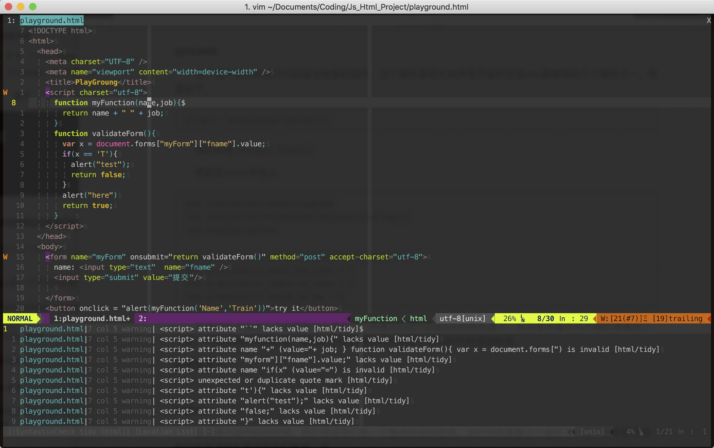
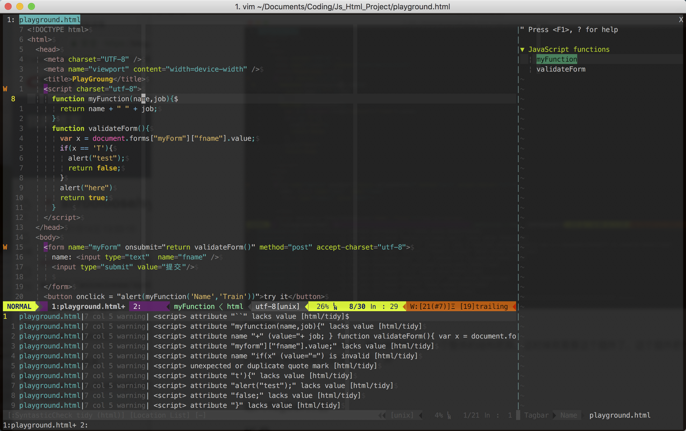
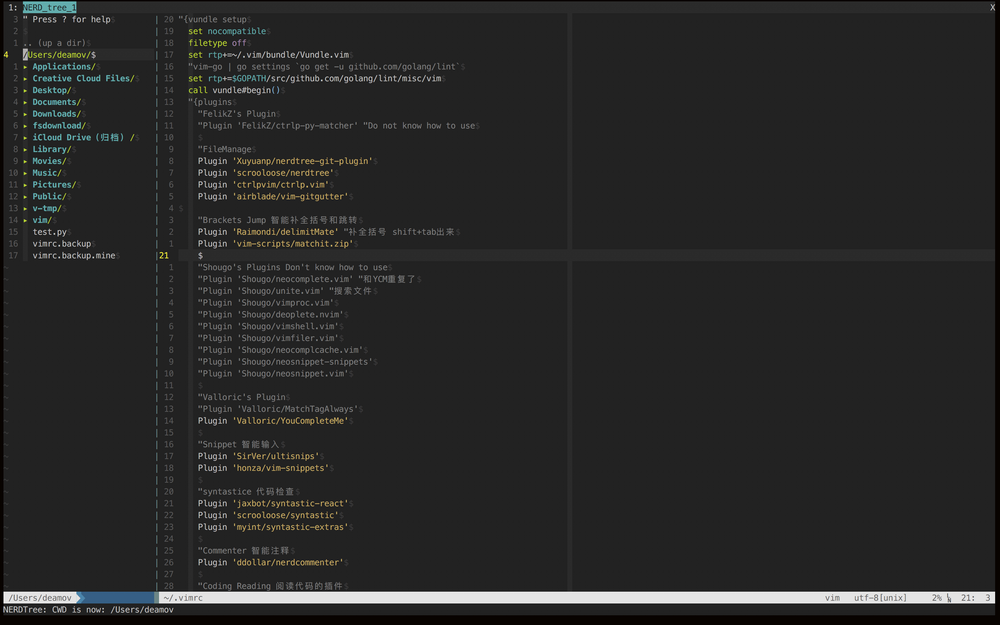
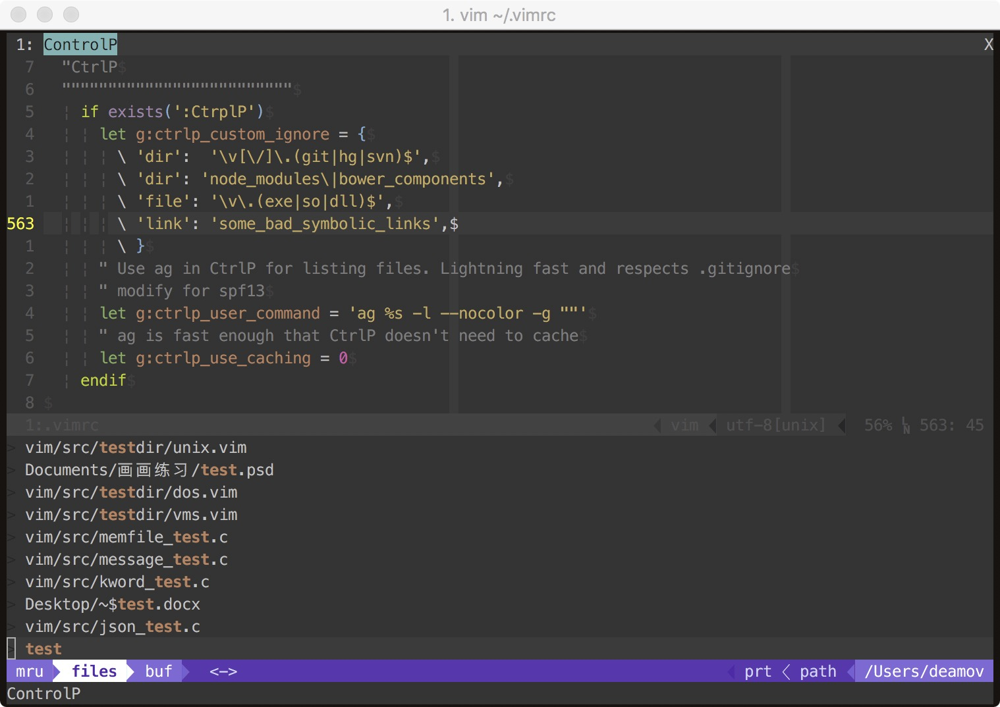

# VIM(新手入门)

## 序言

很多人把vim奉为最强编辑器，有很多很多大牛，用vim作为他们的生产工具。某乎上也一刻不停的争论着，VIM是不是真的有它流传的那么厉害。对于小白，很可能只是用过一两次，就被没有GUI的编辑习惯所劝退，听着大佬们传着VIM多么多么屌，仿佛自己玩的不是同一个游戏。经过一天的调试VIM，我终于在Mac High Sierra下成功配置了我的VIM，也是第一次由衷觉得vim确实是蛮好用的。捎带推荐Mac用户安装iterm2和oh-my-zsh，这里有一个我觉得不错的[教程文章](https://segmentfault.com/a/1190000010518195)。

附上我的成果图：



## VIM的安装和基本操作（小白版）

### VIM的安装（主要针对mac和linux用户，Windows没有试过）

有两个方法二选一：

1、brew install & 从brew安装

```bash
/usr/bin/ruby -e "$(curl -fsSL https://raw.githubusercontent.com/Homebrew/install/master/install)"
//直接执行上述指令即可安装brew
```

```Bash
brew info vim //查看可选选项
brew install python2
brew install vim --with-client-server --with-lua --with-luajit 
//lua和python分别是一些插件的必备条件
//client-server也是必须的，好多插件要用，这个直接编辑源码目前mac是做不到的，linux随意
```

```bash
vim --version | grep python
vim --version | grep lua
//检查python和lua前是否是+号，如果不是重复上述操作，保证python和lua前是+号
```

2、源码编译

```bash
//首先同1的相同，要先安装brew，随后安装git和python，lua是系统自带的好像
brew install git
brew install python
```

```Bash
git clone https://github.com/vim/vim.git ~/vim
//从git上下载vim源码，github速度比较慢，建议科学一下上网
```

```bash
cd ~/vim/ //切换到刚才源码下载的位置
```

```
./configure \
--enable-multibyte \
--enable-perlinterp \
--enable-rubyinterp \
--enable-pythoninterp \
--enable-python3interp \
--enable-luainterp \
--with-lua-prefix=/usr/local \
--enable-cscope \
--with-client-server \
--with-features=huge \
--with-x \
--enable-fontset \
--enable-largefile \
--disable-netbeans \
--with-compiledby="DeamoV" \
--enable-fail-if-missing
```

```
cat log | grep python
cat log | grep lua
//检查python和lua是否编译正常
```

```Bash
make
```

```
sudo make install
//之后vim就安装完成了
vim --version | grep python
vim --version | grep lua
//检查下vim是否成功的支持了python和lua
```

### 基本操作

我个人也是刚认识VIM,以下是我对VIM的自己的理解。

首先VIM分编辑模式和命令模式。

1、编辑模式

​	编辑模式顾名思义就是编辑，就是我们常用的打字，通过点按键`A`或者按键`i`进入，进入编辑模式后，就正常打字输入就是了。想要退出编辑模式进去命令模式就是按键`esc`。

2、命令模式

​	命令模式就是进行一些常用的操作，也是vim下的亮点操作。

​	 `h`,`j`,`k`,`l`分别是控制方向的，方向键也可以，点方向前输入数字就是移动多少行或者多少列，例如`10h`就是想做移动10列，这一点也可以在下面说到的删除操作中应用，例如`10dh`就是往左删除10个字符，而`/`这个按键就是进入搜索模式，在配置文件的帮助下，可以实时的高亮，搜索字符串打完后回车，`n`和`N`分别是向下查找和向上查找，非常方便。

​        `0`跳转到行首，`$`跳转到行尾。

​       `dd`是删除本行，`yy`是复制一行，`p`是黏贴，`u`是撤销。

3、退出和存储

​	在命令行模式下输入`:q`就是退出，`:w`是存储文件，存储命令后接地址就是存储在什么位置，如`:w ~/Document/test.txt`。

​	指令是可以连用的，如`:wq`就是储存并推出。

​	任何指令后加`!`都是强制操作，如`:q!`就是强制退出。

以上就是我常用的操作，其他的操作如分屏显示`:vs`等可以自己百度，或者参见[菜鸟教程](http://www.runoob.com/linux/linux-vim.html)网站中的教程。

## 插件的安装&VIM的美化

​	上面是Vim的一些基本的安装和操作，要做到非常简单，很多IDE端的VIM插件也就实现到这里。不过这样不一定能体验到Vim好玩的地方，接下来介绍的就是Vim最神奇的地方了。对我而言，如果你安装了Vim，没有对配置和插件进行定制化，那么你完全没有体验到Vim好玩的地方，注意这里我说的是好玩，所以不去讨论Vim是否能够提高效率这件事(个人觉得提高效率应该是通过提高自己的思维格局的，而不是一个工具能够改变的)。

### 1、插件的安装

​	所有的Vim的配置文件在`~/.vimrc`目录下，插件会下载到`~/.vim`文件夹下。大部分的插件安装就是简单的，在安装完Vundle插件管理插件后，在配置文件里面加入`Plugin 插件/名`，如`Plugin 'honza/vim-snippets'`，随后输入`:source %`，来生效文件，接下来`:Plugin Install`等就好了。接下来就重启vim就好了。

​	But，有些插件需要额外的配置，这些需要去你要安装的插件的Github下查看需求，如YCM需要单独编译等，个人建议去读Github原文来安装和配置。

​	**Vundle安装**，首先把Vundle下载到`~/.vim/bundle`。

`````
git clone https://github.com/VundleVim/Vundle.vim.git ~/.vim/bundle/Vundle.vim
`````

​	随后在vimrc中配置如下，可以把不需要的Plugin注释掉。

```
set nocompatible              " be iMproved, required
filetype off                  " required

" set the runtime path to include Vundle and initialize
set rtp+=~/.vim/bundle/Vundle.vim
call vundle#begin()
" alternatively, pass a path where Vundle should install plugins
"call vundle#begin('~/some/path/here')

" let Vundle manage Vundle, required
Plugin 'VundleVim/Vundle.vim'

" The following are examples of different formats supported.
" Keep Plugin commands between vundle#begin/end.
" plugin on GitHub repo
Plugin 'tpope/vim-fugitive'
" plugin from http://vim-scripts.org/vim/scripts.html
" Plugin 'L9'
" Git plugin not hosted on GitHub
Plugin 'git://git.wincent.com/command-t.git'
" git repos on your local machine (i.e. when working on your own plugin)
Plugin 'file:///home/gmarik/path/to/plugin'
" The sparkup vim script is in a subdirectory of this repo called vim.
" Pass the path to set the runtimepath properly.
Plugin 'rstacruz/sparkup', {'rtp': 'vim/'}
" Install L9 and avoid a Naming conflict if you've already installed a
" different version somewhere else.
" Plugin 'ascenator/L9', {'name': 'newL9'}

" All of your Plugins must be added before the following line
call vundle#end()            " required
filetype plugin indent on    " required
" To ignore plugin indent changes, instead use:
"filetype plugin on
"
" Brief help
" :PluginList       - lists configured plugins
" :PluginInstall    - installs plugins; append `!` to update or just :PluginUpdate
" :PluginSearch foo - searches for foo; append `!` to refresh local cache
" :PluginClean      - confirms removal of unused plugins; append `!` to auto-approve removal
"
" see :h vundle for more details or wiki for FAQ
" Put your non-Plugin stuff after this line
```

​	最后  后`vim` 中运行`:PluginInstall`，至此Vundle安装就完成了。

​	注意卸载的时候，除了注释掉我们要删除的插件以外，还需要`:source %`之后运行`:Plugin Clean`来清除我们之前删除本地下载的残留插件文件。

### 2、已安装插件介绍

#### 1、美化插件插件

 **airline系列**（`bling/vim-airline`,`vim-airline/vim-airline-themes`）

​	airline是指的，在开开vim后下面的状态栏，可以显示字数，行数，github中是在哪个分支等功能，可以和别的插件如ctrlp，synastic很好的融合，使编译环境更美观和直白。

```vim
Plugin 'bling/vim-airline'
Plugin 'vim-airline/vim-airline-thems'
```

随后执行`:Plugin Install`。

**indentLine**（`Yggdroot/indentLine`）

​	在编代码的时候，需要代码对齐什么的，这时候肉眼去确定比较难，这时候就需要这个插件来辅助。同样的安装如airline。

```
Plugin 'Yggdroot/indentLine'
```

​	随后执行，`:plugin Install`。

**bufferline**（`bling/vim-bufferline`）

​	这个插件，解决的问题就是文件的切换问题，这个插件可以让你在打开的多个文件缓存间切换。

```
Plugin 'bling/vim-bufferline'
```

​	最后执行，`:Plugin Install`。

​	切换的时候输入`:b n`来切换到第n个缓存。

**效果图**



#### **2、代码阅读插件**

**syntastic**

​	这个插件使用来进行代码语法检查的插件，这个插件是和YCM并驾齐驱的安装vim最推荐的几个插件之一。安装如下。

```
Plugin 'scrooloose/syntastic'
```

​	随后同理`:Plugin Install`

​	然后在vimrc中加入，

```
set statusline+=%#warningmsg#
set statusline+=%{SyntasticStatuslineFlag()}
set statusline+=%*

let g:syntastic_always_populate_loc_list = 1
let g:syntastic_auto_loc_list = 1
let g:syntastic_check_on_open = 1
let g:syntastic_check_on_wq = 0
```

​	这里我就不说这几个设置是什么意思了，大家可以把1变成0试试就知道了，其实看变量名就大概知道意思了（笑。不过具体的代码检查，如何对不同的语言的代码进行不同的代码语法检查。这里的设置还是比较复杂的，详情请参考我的vim的配置文件，在文章末尾会给出github地址。

**效果图如下**：



**tagbar**

​	在阅读大段代码的时候，我们希望我们有一个整体的结构把我，这时候就需要这个插件了，这个插件把代码的结构很清晰的展现在我们眼前，并选择我们要的函数时会自动跳转，非常的方便。

```
Plugin 'majutsushi/tagbar'
```

​	正常安装就好。



​	使用方法输入，`:Tagbar`开启

**代码高亮**

​	代码高亮是一个非常有用的功能，vim其实是自带的有的，可以进行配置，详细参数请自行百度，但是直接使用我的配置文件就应该是okay的。不过自带的对代码的高亮支持有限，推荐去自行安装自己需要的代码高亮插件。比如我安装的solidity的代码高亮的插件是，`Plugin 'tomlion/vim-solidity'`，这些每个人的需求不同安装很简单所以就不赘述了。

**代码折叠**

​	代码折叠也是很重要的，我这里就简单介绍下如何使用吧，首先查找相关教程的指令是，

`:help folding`，在这里可以查找到我们想要的所有快捷键。

​	常用操作：

```
`zR` 打开所有折叠
`zM` 关闭所有折叠
`za` 打开或关闭光折叠, `zA` 循环打开或关闭折叠
`zi` 翻转 'foldenable' 的值
`zj` 移动光标到下一个折叠开始处, `zk` 类似 `zj`
`[z` 移动光标到当前打开的折叠的开始处, `]z` 类似 `[z]`
```

#### 3、编写代码操作

**YouComplteMe**

​	这个插件简直就是神一般的插件，他不仅可以给你补全代码，还能帮你补全路径，妈妈再也不用担心我打错路径了。不过遗憾的是，这个插件是vim所有插件中最难装的，而且加上github被限速以后更加的难以安装（因为中间git的时候容易失败，不过用ssh git会好很多，强烈建议在用终端的时候先用export进行番羽操作）

​	首先给出[官方文档](https://github.com/Valloric/YouCompleteMe)，安装任何插件，优先使用最官方的文档，任何人的博客包括我都只能作为参考，请习惯查阅官方手册会让很多事情变得简单，同理类比Cuda的安装。

​	以下为安装步骤。

​	首先你必须安装了最新的Xcode，然后使用使用指令，`xcode-select —install`。

​	在vimrc中加入`Plugin 'Valloric/YouCompleteMe'`,随后`:Plugin Install`。之后会在vim下`bundle`目录下出现`YouCompeteMe`文件夹，切换到那个目录，随后运行`./isntall.py --all`，如果只想安装个别的代码补全请自行参考官方文档。

​	很遗憾的是，这么做，`./install.py`，肯定是会报错的，其实这里的原因是里面引入了第三方的仓库，所以还需要手动的输入`git submodule update --init --recursive`来把那部分补充下载下来。然后再install就好了。

​	最后，把给出的样例文件拷到根目录下，就可以生成了。注意这一步，我独居YCM的了解不够多，还没有深入了解，有兴趣的朋友可以深入了解，这里如何DIY来更加符合个人的使用情况。

```
cp ~/.vim/bundle/YouCompleteMe/third_party/ycmd/examples/.ycm_extra_conf.py ~/
```

​	然后vimrc中的配置请参考我的vimrc配置，Github中git下来覆盖你的vimrc就好了，到此安装就结束了。

​	其他的错误的坑，报错如下。

```
YouCompleteMe unavailable+ Symbol not found: __PyCodecInfo_GetIncrementalDecoder 
```

​	问题可能是python的安装环境的问题，问题[参考如下](https://github.com/Valloric/YouCompleteMe/issues/2218)，这里推荐下，遇到问题请先查阅这个开源项目中的issue，一般都会找到合适的答案的，任何没经过自己的努力就求助别人的伸手党行为都是可耻的。

​	解决方案如下：执行完就好了之后你想在link回去也是okay的。

```
brew unlink python@2
brew unlink python
```

**Snippets**

​	这里就是我最喜欢的部分了，想来大家编程的小哥哥小姐姐们都知道，我们每次打代码的时候最烦的就是重复性输入了，这两个插件就是用来解决这个问题的（目前本人还没挖透他），所以都一直在用着别人写好的snippets。这个功能怎么说呢，就是快速的把输入全帮你输入了。

```
#输入dowh，然后tab直接帮你输入了所有的代码,然后把光标放到你要注意输入的地方。
do{
    //
}while()
```

​	最重要的是，这里你不需要自己造轮子，有很多别人编好的snippets，你用Plugin装了就好了，当你熟练后也可以自己来写。

​	安装方法：vimrc中加入，`SirVer/ultisnips`和`Hones/vim-snippets`，然后`:Plugin Install`一下就ojbk了。

**括号引号方面**

​	这个是用来补全括号和引号的插件，我们编写代码的时候我们会输入大量的括号和引号，如果我们每次都手动补全的话会非常的麻烦这里就是用以下两个插件`Raimondi/delimitMate`和`vim-scripts/matchit.zip`。同样的安装手法，安装完成后会自动补全，最终要的是会把光标移回括号的中间，当打完内容后`shift+tab`就可以轻松移出，matchit则是提供了`%`来自动跳转匹配的括号。

**注释**

​	我选的是[nerdcommenter](https://github.com/scrooloose/nerdcommenter),输入`Plugin ddollar/nerdcommenter`，随后正常安装即可。他支持很多中注释方案，你可以去官方查看说明。个人常用的就是`<leader>cc`进行注释，`<leader>c+space`进行取消注释非常的方便。

#### 4、文件管理

**NERDTree**

​	插件就非常的舒服了，它可以在边栏打开一个文件目录，选中可以打开目录，非常的方便。

`Plugin scrooloose/nerdtree`进行安装。

​	效果图如下



**Ctrlp**

​	这里要注意，我的Ctrlp是和ctrl-py-matcher一起装的，如果只装了一个会报错的。同时我的环境中使用了ag来搜索。

​	ag的安装`brew install the_silver_searcher`。

​	使用方法为，`ctrl+p`之后输入你要搜索的文件，他会在当前目录以及目录下子目录的文件进行模糊搜索，速度非常快。搜索一次后会缓存下来，下次就不用缓存了。注意，不要去root目录下打开，文件太多要等好久。

​	其他操作为，`c-f`和`c-b`钱还mru，file还是buffer模式。`c-r`开启正则表达式，`c-j`,`c-k`上下移动。

`c-t`,`c-v`,`c-x`分屏打开。`c-z`标记文件，然后`c-o`一起打开他们。

​	效果图如下



### **如何打造自己的顺手的VIM**

​	说实话，别人的配置不一定适合你。使用别人的配置然后理解这些配置是入门的开始。随着实际工作的需要我们会慢慢的添加新的功能，相信我，大部分能想到的功能它都能做到，比如Latex论文书写和实时展示，Solidity的代码高亮和语法检查等等。插件的安装大部分都非常简单，在这个网站中搜索你要的插件，然后就和之前咱们安装插件的步骤一样，加入Plugin，Install一件合成。如果你遇到了现有插件满足不了你的的情况，不要犹豫，请动手构建属于我们自己的插件再上传为VIM社区贡献自己的力量。

### 还有一件事情

​	能阅读到这里的小伙伴，我相信你们一定不是伸手党，所以在这里我附上了我的配置文件，下载下来按照说明进行配置，希望你们能达到和我一样的效果。我的[Github地址](https://github.com/VDeamoV/VDeamoV-vimrc)。在里面我提供了一个脚本，可以尝试着一键运行，但是推荐打开看看，一行一行自己运行。

### 最后

​	这个文章写作用时5小时以上，如果有帮助到你的话，希望能关注下我的Github，博客，给个星星什么的。


date 2018.5.13


